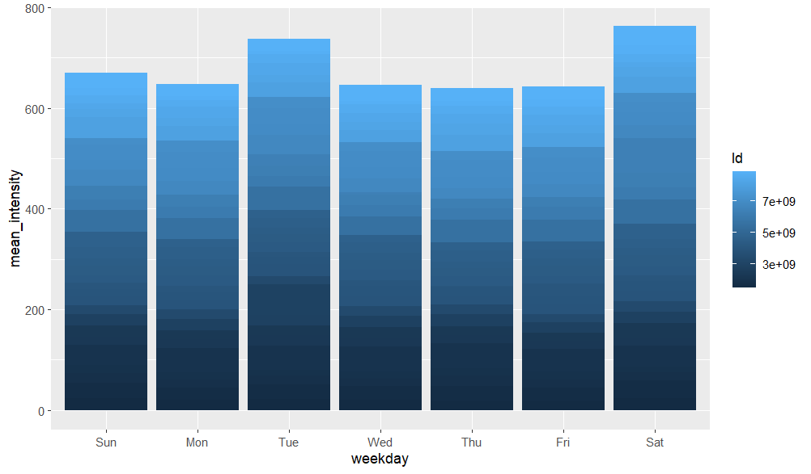
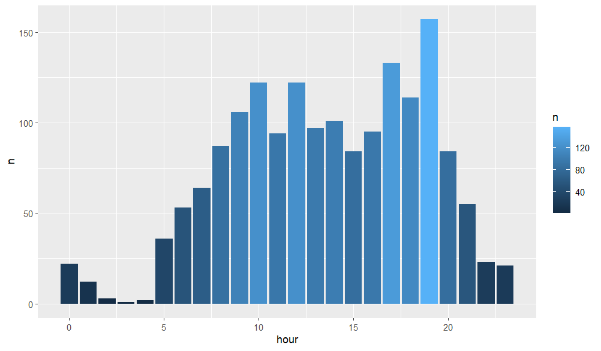
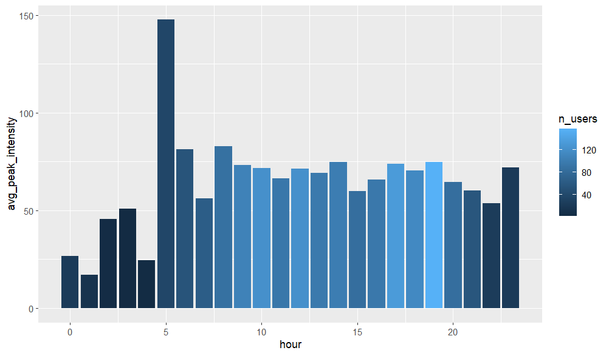

## Scenario context

Bellabeat wants me to find trends in smart device usage so they can apply new functions to their concepts. 

---

## Ask

### Main goals and expectations from the stakeholders


* What are some trends in smart device usage?

* How could these trends apply to Bellabeat customers?

* How could these trends help influence Bellabeat marketing strategy?


---

## Prepare

### Quick desciption of the datasets and tools

For this project, I will use the Fitabase archive dataset. Everything needed should be found in this archive for the business task at hand.
I'll import the tidyverse packages along with ggplot2. As for the data itself the credibility is not to be doubted. 

---

## Process

### Data cleaning and preparation steps

In this section, I perform the necessary transformations to prepare the data for analysis.

This includes:

* importing all useful dataframes,

```{r importing, eval= FALSE}

library(tidyverse)
library(ggplot2)
library(lubridate)
library(dplyr)

daily_acitvity <- read_csv("dailyActivity_merged.csv")
heartrate_seconds <- read_csv("heartrate_seconds_merged.csv")
hourly_calories <- read_csv("hourlyCalories_merged.csv")
daily_acitvity_2 <- read_csv("other/dailyActivity_merged.csv")
hourly_calories_2 <- read_csv("other/hourlyCalories_merged.csv")
heartrate_seconds_2 <- read_csv("other/heartrate_seconds_merged.csv")
hourly_intensity <- read_csv("hourlyIntensities_merged.csv")
hourly_intensity_2 <- read_csv("other/hourlyIntensities_merged.csv")


```

* isolate date and time data, create a weekday variable and combine dataframes,

```{r formatting_merging, eval= FALSE}

daily_acitvity <- daily_acitvity %>%
	mutate(ActivityDate = mdy(ActivityDate),
	week_num = isoweek(ActivityDate))

daily_acitvity_2 <- daily_acitvity_2 %>%
	mutate(ActivityDate = mdy(ActivityDate),
	week_num = isoweek(ActivityDate))

daily_activity_merged <- bind_rows(daily_acitvity, daily_acitvity_2)

hourly_intensity_merged <- bind_rows(hourly_intensity, hourly_intensity_2)

hourly_intensity_merged <- hourly_intensity_merged %>%
	mutate(ActivityHour = mdy_hms(ActivityHour),
	week_num = isoweek(ActivityHour))

hourly_intensity_merged <- hourly_intensity_merged %>%
	mutate(weekday = wday(ActivityHour, label = TRUE)) %>%
	filter(TotalIntensity > 0)

hourly_intensity_merged <- hourly_intensity_merged %>%
	mutate(ActivityDate = as.Date(ActivityHour))


```

---


## Analyze

### Find trends and patterns

Here I assemble and sort key statistics that relate directly stakeholder questions:

* average intensity per days of the week,

```{r summary_table, eval= FALSE}

summary_table <-hourly_intensity_merged %>%
	group_by(Id, weekday) %>%
	summarise(mean_intensity = mean(TotalIntensity))


```
This summmary shows the average intensity for each of day of the week.


* peak of intensity per days per user,

```{r daily_peak, eval= FALSE}

daily_peaks <- hourly_intensity_merged %>%
	group_by(Id, ActivityDate) %>%
	summarise(max_intensity = max(TotalIntensity),
	 .groups = "drop")


```
This dataframe gives the highest intensity for each day and for each user.

* hour of the intensity peak per day per user,

```{r peak_hours, eval= FALSE}

daily_peak_hours <- hourly_intensity_merged %>%
  group_by(Id, ActivityDate) %>%
  slice_max(TotalIntensity, n = 1, with_ties = FALSE) %>%
  ungroup()


```
This gives the time (hour) of the highest intensity of each day for each user.

* calculate which hour of the day is the most common for peaks of intensity,


```{r trend_hours, eval= FALSE}

peak_hour_trend <- daily_peak_hours %>%
  mutate(hour = hour(ActivityHour)) %>%
  count(hour, sort = TRUE)


```
This calculates how many times each hour of the day is used as highest intensity.


* pull peak hours by user,

```{r peak_hour_users, eval=FALSE}

peak_hour_by_user <- daily_peak_hours %>%
  mutate(hour = hour(ActivityHour)) %>%
  group_by(Id, hour) %>%
  summarise(n = n(), .groups = "drop")


```
This tells us how many times for each user a certain hour of day was the highest intensity.


* find average peak intensity with most users at once,

```{r peak_summary, eval=FALSE}

peak_summary <- daily_peak_hours %>%
     group_by(hour) %>%
     summarise(
         avg_peak_intensity = mean(TotalIntensity),
         n_users = n()
     )

```
This combines some of the earlier findings to tell us the average peak of intensity and how many users contributed for each hour of the day.

---

## Share 

### Make datasets easy to understand and show story through visualizations

In this section I have created some visualizations to make the data more comprehensible and easier to understand.


* Average intensity by weekdays.

```{r image_1, echo=FALSE}



```

* Hours by number of users.

```{r image_2, echo=FALSE}



```

* Peak intensity by hours per users.

```{r image_3, echo=FALSE}



```


---


## Act 

### Recommendations based on observed usage patterns

* Activity intensity is higher on Tuesdays and Saturdays, suggesting a mix of structured weekday routines and weekend discretionary effort. Bellabeat could align feature prompts or reminders with these higher-intensity days.

* The most common time for peak daily intensity is around 19:00 (7:00 PM), indicating that many users engage in their most intense activity after typical work hours. Evening-focused notifications or recovery features may resonate with this behavior.

* Although fewer users peak early in the morning, the highest average peak intensity occurs around 5:00 AM. This suggests a smaller but highly committed group of early-morning users, which could be supported through specialized content or tailored motivational messaging.

Overall, these trends indicate distinct usage profiles throughout the day that Bellabeat could leverage for more personalized engagement.

 
 
 
 
 
 
 


 
 


 
 